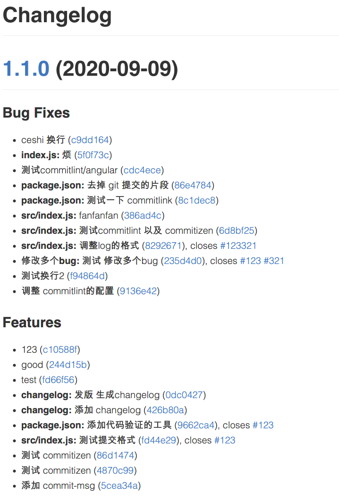

## 【step-by-step】12. 使用 standard-version 生成 CHANGELOG.md

> 本篇文档的目的是希望前端同学能够以 `复制粘贴` 的方式，快速在 [webpack 工程](../examples/01-base) 中添加插件。因此，一些说明性质的知识将以 `推荐阅读` 的方式推荐给大家。

<!-- START doctoc generated TOC please keep comment here to allow auto update -->
<!-- DON'T EDIT THIS SECTION, INSTEAD RE-RUN doctoc TO UPDATE -->

- [TL;DR](#tldr)
- [12.1 步骤](#121-%E6%AD%A5%E9%AA%A4)
- [12.2 具体流程](#122-%E5%85%B7%E4%BD%93%E6%B5%81%E7%A8%8B)
  - [12.2.1 安装依赖](#1221-%E5%AE%89%E8%A3%85%E4%BE%9D%E8%B5%96)
  - [12.2.2 添加命令](#1222-%E6%B7%BB%E5%8A%A0%E5%91%BD%E4%BB%A4)
  - [12.2.3 添加 standard-version 的配置](#1223-%E6%B7%BB%E5%8A%A0-standard-version-%E7%9A%84%E9%85%8D%E7%BD%AE)
- [12.3 测试](#123-%E6%B5%8B%E8%AF%95)
- [12.4 示例工程](#124-%E7%A4%BA%E4%BE%8B%E5%B7%A5%E7%A8%8B)
- [12.5 总结](#125-%E6%80%BB%E7%BB%93)
- [推荐](#%E6%8E%A8%E8%8D%90)

<!-- END doctoc generated TOC please keep comment here to allow auto update -->

### TL;DR

对于 Git 日志，我们期待的流程是：

- [x] [commitizen](./10-add-commitizen.md) ： 生成 commit message 的约定模板。
- [x] [commitlint](./11-add-commitlint.md)： 检查 commit message 是否符合提交格式。
- [ ] [standard-version](./12-add-changelog.md) ： 每次发版的时候，生成 `changelog.md`，方便查看`发版信息`以及`工单与代码的对应关系`。

当前比较推荐的日志格式是 [Angular Git Commit Guidelines](https://github.com/angular/angular.js/blob/master/DEVELOPERS.md#-git-commit-guidelines) 。因此，我们后面所使用的插件也是基于 `angular` 日志格式的。

接下来将介绍如何在系统安装 `standard-version`，并使用它根据 Git 日志生成 `changelog.md`。

生成 `changelog.md` 的两种方式：

- [standard-version](https://github.com/conventional-changelog/standard-version)
- [conventional-changelog-cli](https://www.npmjs.com/package/conventional-changelog-cli)

### 12.1 步骤

根据 [standard-version](https://github.com/conventional-changelog/standard-version) 和 [用工具思路来规范化 git commit message](https://github.com/pigcan/blog/issues/15) 中的示例，我们在 [webpack 工程 08](../examples/08-add-commitizen) 中添加 `standard-version`的步骤：

- 安装依赖
- 调整 `package.json` 中的配置

示例工程： [09-add-changelog](../examples/09-add-changelog) (与上一个例子放在一个demo里了)

### 12.2 具体流程

#### 12.2.1 安装依赖

```bash
yarn add standard-version replace -D
```

#### 12.2.2 添加命令

在 `package.json` 文件中，添加 `script.release`

```json
{
  "script": {
    "release": "standard-version --no-verify --header '# Changelog'"
  }
}
```

#### 12.2.3 添加 standard-version 的配置

添加 standard-version 的配置，并把 issue 的地址换掉（standard-version 默认是将 git 的地址作为 issue 的地址，但是我们有自己的 bug 系统）。

```json
{
  "standard-version": {
    "scripts": {
      "postchangelog": "replace 'https://example.com/crazyvalse/myexamples/issues/' 'https://example.com/browse/' CHANGELOG.md"
    },
    "skip": {
      "commit": true,
      "tag": true
    }
  }
}
```

### 12.3 测试

运行下面的命令，插件将帮我们生成 `CHANGELOG.md` 文件。

```bash
npm run release
```



### 12.4 示例工程

示例工程： [09-add-changelog](../examples/09-add-changelog)

```
|-- examples
    |-- .babelrc
    |-- .editorconfig
    |-- .eslintignore
    |-- .eslintrc.js
    |-- .gitignore
    |-- .postcssrc.js
    |-- .prettierignore
    |-- .prettierrc.js
    |-- .stylelintrc
    |-- CHANGELOG.md // 新生成的 changelog 文件
    |-- commitlint.config.js
    |-- directoryList.md
    |-- index.html
    |-- package.json
    |-- build
    |   |-- webpack.base.js
    |   |-- webpack.dev.js
    |   |-- webpack.prod.js
    |-- src
        |-- index.js
        |-- assets
        |   |-- style.css
        |-- js
            |-- utils.js
```

### 12.5 总结

在工程中添加 `standard-version` 的步骤：

- 安装依赖
- 调整 `package.json` 中的配置

### 推荐

- [用工具思路来规范化 git commit message](https://github.com/pigcan/blog/issues/15)
